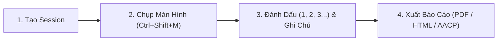

# August Guide 🖊️

> **"Mark everything, review later"** — *Chụp màn hình nhanh, đánh dấu trực quan, ghi chú lỗi và tạo tài liệu hướng dẫn chỉ trong vài giây.*

[](https://github.com/August-Trung/august-guide/releases)
[](LICENSE)
[]()
[](https://tauri.app/)

---

## 🎯 August Guide là gì?

**August Guide** là ứng dụng máy tính (Desktop App) gọn nhẹ, hiện đại giúp bạn:
- **Chụp ảnh màn hình tức thì** ở bất kỳ phần mềm nào chỉ bằng một nút bấm hoặc giữ chuột.
- **Vẽ ghi chú, đánh số thứ tự (1, 2, 3...)**, khoanh vùng lỗi, chỉ mũi tên và làm mờ các thông tin riêng tư.
- **Tạo báo cáo lỗi (Bug Report) & Tài liệu hướng dẫn (User Guide)** chuyên nghiệp, xuất ra các định dạng PDF, HTML, Markdown, CSV hoặc gói dữ liệu tự động sửa lỗi cho AI (Cursor, Claude, Antigravity).
- **Phù hợp cho mọi đối tượng:** Tester (QA/QC), Lập trình viên (Developer), Nhà thiết kế (Designer), Quản lý dự án (PM) và cả người dùng văn phòng không chuyên về kỹ thuật.

---

## 🛡️ Cam Kết Bảo Mật & Quyền Riêng Tư (Privacy & Transparency First)

August Guide được xây dựng theo triết lý **Offline-First (Ưu tiên hoạt động ngoại tuyến)** và **Bảo vệ quyền riêng tư tuyệt đối**:

- 🔒 **100% Dữ liệu lưu trữ cục bộ:** Toàn bộ ảnh chụp màn hình, ghi chú và cơ sở dữ liệu SQLite nằm hoàn toàn trên ổ cứng máy tính của bạn (tại thư mục `%APPDATA%\com.august.guide\` trên Windows).
- 🚫 **Không máy chủ theo dõi trung gian (Zero Telemetry):** Ứng dụng không gửi bất kỳ hình ảnh hay dữ liệu cá nhân nào về máy chủ của nhà phát triển.
- 🙈 **Công cụ Làm mờ (Blur / Redact) tích hợp:** Dễ dàng che mờ mật khẩu, số thẻ ngân hàng, email hoặc thông tin nhạy cảm trước khi lưu hoặc chia sẻ ảnh.
- ☁️ **Đồng bộ Google Drive an toàn & minh bạch:** Tính năng sao lưu đám mây chỉ kết nối trực tiếp đến tài khoản Google Drive cá nhân của bạn thông qua giao thức chuẩn **OAuth 2.0 (PKCE)**. Không có bên thứ ba nào có quyền truy cập.

---

## ⌨️ Bảng Tra Cứu Phím Tắt & Cử Chỉ Thao Tác (Shortcuts Cheat Sheet)

August Guide hỗ trợ hệ thống phím tắt tối ưu giúp bạn làm việc với tốc độ nhanh nhất mà không cần phải nhấp chuột nhiều lần:

### 1. Kích hoạt Chụp Màn Hình (Global Triggers)
Bạn có thể gọi màn hình chụp khi đang mở bất kỳ ứng dụng nào khác (trình duyệt, game, phần mềm làm việc):

| Thao tác | Cách thực hiện | Ý nghĩa |
| :--- | :--- | :--- |
| **Phím tắt toàn cục** | <kbd>Ctrl</kbd> + <kbd>Shift</kbd> + <kbd>M</kbd> | Bật ngay màn hình chụp ảnh toàn màn hình |
| **Cử chỉ chuột tiện lợi** | **Nhấn & Giữ chuột giữa (Middle Mouse)** trong **1 giây** | Chụp màn hình tức thì chỉ với một tay cầm chuột |

---

### 2. Bộ Phím Số Chọn Công Cụ Vẽ (Khi đang trong màn hình chụp)

| Phím tắt | Tên công cụ | Tác dụng |
| :---: | :--- | :--- |
| <kbd>1</kbd> | **Marker (Ghim số thứ tự)** | Bấm vào màn hình để tạo các số tròn tự tăng (1, 2, 3...) đánh dấu từng bước thực hiện. |
| <kbd>2</kbd> | **Rectangle (Khung chữ nhật)** | Kéo chuột để tạo khung viền khoanh vùng khu vực có lỗi hoặc cần lưu ý. |
| <kbd>3</kbd> | **Arrow (Mũi tên)** | Kéo chuột để vẽ mũi tên chỉ chính xác vào nút bấm hoặc vị trí mong muốn. |
| <kbd>4</kbd> | **Text (Chữ ghi chú)** | Nhấp vào ảnh để gõ chú thích chữ trực tiếp lên màn hình. |
| <kbd>5</kbd> | **Freehand (Vẽ tự do)** | Dùng chuột vẽ tay tự do (khoanh tròn, gạch chân, viết chữ phác thảo). |
| <kbd>6</kbd> | **Blur (Làm mờ bảo mật)** | Quét chuột lên vùng chứa mật khẩu, email hoặc thông tin nhạy cảm để làm mờ. |
| <kbd>7</kbd> | **Highlight (Tô sáng)** | Tô lớp màu vàng trong suốt nổi bật vùng văn bản quan trọng. |
| <kbd>8</kbd> | **Spotlight (Chiếu sáng)** | Làm sáng vùng được chọn và tối dần xung quanh để người xem tập trung vào điểm nhấn. |
| <kbd>9</kbd> hoặc <kbd>C</kbd> | **Crop (Cắt khung ảnh)** | Cắt lấy riêng một khu vực màn hình cần thiết thay vì chụp toàn bộ. |

---

### 3. Phím Thao Tác & Điều Khiển Nhanh

| Phím tắt | Chức năng |
| :--- | :--- |
| <kbd>Ctrl</kbd> + <kbd>Z</kbd> | **Hoàn tác (Undo):** Hủy nét vẽ hoặc chú thích vừa thực hiện. |
| <kbd>Ctrl</kbd> + <kbd>Y</kbd> | **Làm lại (Redo):** Phục hồi lại nét vẽ vừa bấm hoàn tác. |
| <kbd>Ctrl</kbd> + <kbd>C</kbd> | **Sao chép ảnh (Copy to Clipboard):** Copy ngay ảnh đã vẽ vào bộ nhớ tạm để Paste (<kbd>Ctrl+V</kbd>) gửi vào Zalo, Slack, Messenger, Telegram,... |
| <kbd>Ctrl</kbd> + <kbd>S</kbd> | **Lưu & Đóng (Save):** Lưu ảnh kèm các ghi chú vào ứng dụng và đóng màn hình chụp. |
| <kbd>Tab</kbd> | **Ẩn / Hiện Bảng ghi chú bước:** Đóng mở nhanh thanh trượt bên phải để nhập tiêu đề/mô tả lỗi. |
| <kbd>H</kbd> | **Ẩn / Hiện Thanh công cụ (Hide UI):** Thu gọn thanh trên & dưới để có tầm nhìn bao quát toàn bộ ảnh chụp. |
| <kbd>Delete</kbd> / <kbd>Backspace</kbd> | **Xóa chú thích:** Rê chuột vào một số thứ tự hoặc nét vẽ bất kỳ rồi bấm để xóa riêng nét đó. |
| <kbd>Esc</kbd> | **Hủy bỏ / Thoát:** Đóng form đang mở hoặc hủy phiên chụp màn hình hiện tại. |

---

## 📖 Hướng Dẫn Sử Dụng Nhanh (Dành cho Người Mới Bắt Đầu)

Chỉ với 4 bước đơn giản, bạn có thể tạo một báo cáo lỗi hoặc bài hướng dẫn hoàn chỉnh:



### Bước 1: Tạo Dự Án (Project) & Phiên Làm Việc (Session)
- Mở **August Guide**.
- Tại trang chính, bấm nút **Tạo Dự án mới** (ví dụ: *Website Bán Hàng*, *Ứng dụng Mobile*).
- Trong dự án, tạo một **Session** (Phiên kiểm thử) tương ứng với nội dung cần làm (ví dụ: *Kiểm tra luồng Đặt hàng*, *Hướng dẫn đăng ký tài khoản*).

### Bước 2: Chụp Màn Hình Nhanh
- Mở ứng dụng hoặc trang web bạn muốn ghi chú.
- Nhấn tổ hợp phím **<kbd>Ctrl</kbd> + <kbd>Shift</kbd> + <kbd>M</kbd>** (hoặc **nhấn giữ chuột giữa 1 giây**).
- Màn hình sẽ lập tức đóng băng và mở giao diện vẽ ghi chú.

### Bước 3: Đánh Dấu Lỗi & Thao Tác
- Nhấn phím <kbd>1</kbd> để ghim các số **1, 2, 3...** vào các nút cần thao tác.
- Nhấn phím <kbd>2</kbd> để khoanh ô đỏ, phím <kbd>3</kbd> để trỏ mũi tên, hoặc phím <kbd>6</kbd> để che thông tin bảo mật.
- Bảng ghi chú bên phải sẽ tự động hiển thị để bạn gõ tiêu đề, mô tả lỗi và chọn mức độ nghiêm trọng (Thấp, Trung bình, Cao, Nghiêm trọng).

### Bước 4: Lưu & Xuất Báo Cáo
- Nhấn <kbd>Ctrl</kbd> + <kbd>S</kbd> để hoàn tất.
- Trở về giao diện August Guide, chọn **Xuất báo cáo (Export)**:
  - 📄 **PDF / HTML Báo cáo:** Xuất tài liệu đẹp mắt gửi cho khách hàng, sếp hoặc đồng nghiệp.
  - 📊 **CSV:** Nhập trực tiếp danh sách lỗi vào Jira, Trello, Linear.
  - 🤖 **AACP (.zip):** Xuất gói dữ liệu chuẩn để đưa cho AI Coding Agent (Cursor, Claude, Antigravity) tự đọc lỗi và sửa code.

---

## 🚀 Các Tính Năng Nổi Bật Khác

- ☁️ **Sao lưu Đám mây Google Drive (Cloud Backup & Restore):** Sao lưu toàn bộ ảnh và cơ sở dữ liệu lên Google Drive cá nhân, dễ dàng khôi phục lại khi đổi máy tính.
- 🔗 **Tạo Liên kết Chia sẻ Báo cáo (Cloud Share Link):** Đồng bộ báo cáo PDF lên Google Drive và lấy link xem trực tuyến gửi cho đối tác tức thời.
- 🌐 **Hỗ trợ Đa Ngôn Ngữ (i18n):** Chuyển đổi linh hoạt giữa **Tiếng Việt** và **English** ngay trong phần Cài đặt mà không cần khởi động lại.
- 🏷️ **Hệ Thống Thẻ Nhãn (Tags) & Bộ Lọc Nâng Cao:** Gắn tag phân loại lỗi (UI, Backend, Logic, Payment...) và tìm kiếm nhanh bằng thanh Search toàn cục.
- 📥 **Chế độ Chạy Ẩn Khay Hệ Thống (System Tray):** Ứng dụng tự động thu nhỏ xuống góc màn hình để luôn sẵn sàng chụp mà không gây vướng víu.

---

## 📦 Tải Về & Cài Đặt (Dành Cho Người Dùng)

Bạn có thể tải phiên bản mới nhất tại mục [**GitHub Releases**](https://github.com/August-Trung/august-guide/releases):

- **Bản cài đặt Windows (`.msi` / `.exe`):** Tải về và nhấp đúp để cài đặt tự động.
- **Bản Linux (`.deb` / `.AppImage`):** Dành cho hệ điều hành Ubuntu / Debian / Linux.

---

## 💻 Hướng Dẫn Dành Cho Lập Trình Viên (Developer Guide)

Nếu bạn muốn đóng góp hoặc tự biên dịch mã nguồn từ đầu:

### Yêu Cầu Môi Trường
- **Node.js:** Phiên bản 20 trở lên ([nodejs.org](https://nodejs.org/))
- **Rust Toolchain:** Cài đặt thông qua [rustup.rs](https://rustup.rs/)
- **C++ Build Tools:** Visual Studio Build Tools (Windows) hoặc build-essential (Linux)

### 1. Sao Chép Mã Nguồn & Cài Đặt Thư Viện
```bash
git clone https://github.com/August-Trung/august-guide.git
cd august-guide
npm install
```

### 2. Thiết Lập Biến Môi Trường (Google Drive API)
Sao chép tệp cấu hình mẫu và điền thông tin OAuth nếu bạn muốn kiểm thử tính năng Google Drive:
```bash
cp .env.example .env
```
*(Nếu không điền, ứng dụng vẫn hoạt động đầy đủ tất cả các tính năng chụp, vẽ, xuất báo cáo ngoại tuyến bình thường).*

### 3. Khởi Chạy Ứng Dụng Ở Chế Độ Phát Triển (Dev Mode)
```bash
npm run tauri dev
```

### 4. Đóng Gói Ứng Dụng (Production Build)
```bash
npm run tauri build
```
Bộ cài đặt sau khi đóng gói sẽ nằm tại thư mục `src-tauri/target/release/bundle/`.

---

## 🤝 Đóng Góp & Tác Giả

Dự án được xây dựng và phát triển bởi **August Trung**.

Mọi ý kiến đóng góp, báo lỗi hoặc đề xuất tính năng mới, xin vui lòng tạo [**Issue**](https://github.com/August-Trung/august-guide/issues) hoặc gửi **Pull Request** trên kho mã nguồn này.

---

<p align="center">
  <b>August Guide</b> • Make bug reporting simple, visual, and secure.
</p>
